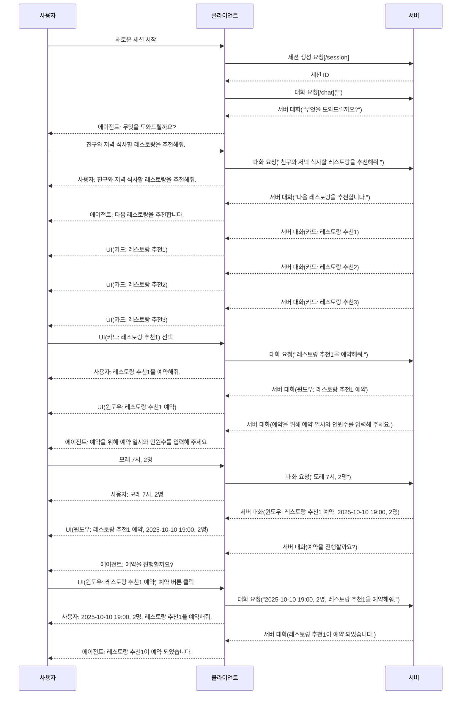
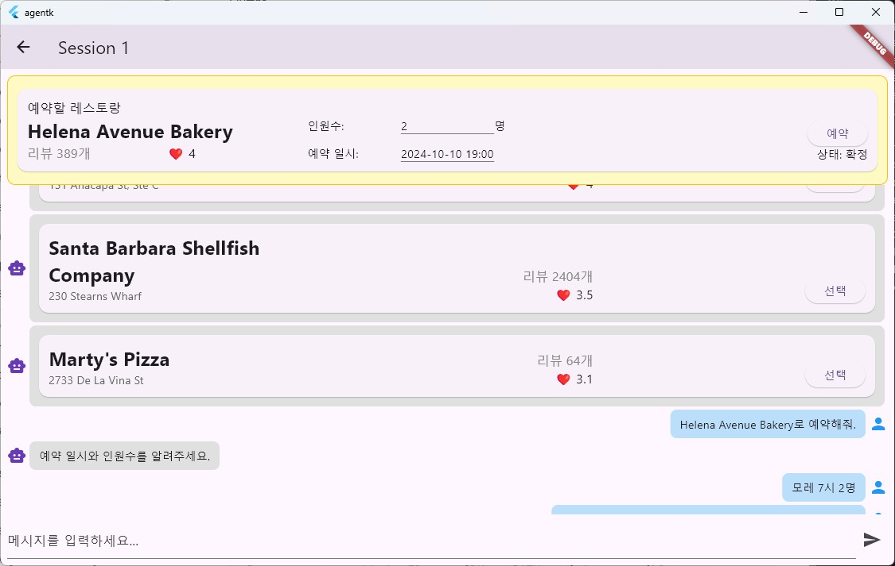

# agentk 프로젝트

agentk는 클라이언트(Flutter)와 서버(Python)로 구성된 프로젝트입니다. 아래에 각 구성 요소의 빌드 및 실행 방법을 안내합니다.

---

## 클라이언트 (Flutter)

### 환경 설정
1. [Flutter SDK](https://docs.flutter.dev/get-started/install) 설치
    * Don't install Flutter to a directory or path that meets one or both of the following conditions:
        - The path contains special characters or spaces.
        - The path requires elevated privileges.

2. 프로젝트 디렉터리에서 의존성 설치:
	 ```cmd
	 flutter pub get
	 ```

### 빌드 및 실행
- **모바일(Android/iOS):**
	```cmd
	flutter run -d android
    flutter run -d ios
	```
- **웹:**
	```cmd
	flutter run -d chrome
    flutter run -d edge
	```
- **데스크탑(Windows/Linux/Mac):**
	```cmd
	flutter run -d windows
	flutter run -d linux
	flutter run -d macos
	```
---

## 테스트 서버 (Python)

### 환경 설정
1. [Python 3.8+](https://www.python.org/downloads/) 설치
2. 필요한 패키지 설치:
	 ```cmd
	 pip install fastapi uvicorn
	 ```

### 실행 방법
- 테스트 서버 실행:
	```cmd
	uvicorn server.test_server:app --port 5000 --reload
	```
	- 기본적으로 `server/test_server.py`의 FastAPI 앱을 실행합니다.
        - 클라이언트의 세션 생성과 대화 요청은 HTTP POST로 요청합니다.
        - 서버의 메시지는 Streamable HTTP로 서버에서 클라이언트로 stream 됩니다.
    - 테스트 서버는 클라이언트로부터 대화 요청을 받으면, 서버가 제공할 메시지를 사용자로부터 입력 받습니다. 공백 라인이 입력되면, 입력된 메시지를 하나씩 전송합니다.
        - 다음은 count 값을 증가시키는 카드를 생성합니다.
        ```json
        {"card":{"widgets":[{"type":"row","children":[{"type":"text","value":"count={count}"},{"type":"button","text":"increase","actions":[{"count":"{count+1}"}]}]}]}}
        ```
        ```json
        {
            "card": {
                "widgets": [
                    {
                        "type": "row",
                        "children": [
                            {
                                "type": "text",
                                "value": "count={count}"
                            },
                            {
                                "type": "button",
                                "text": "increase",
                                "actions": [
                                    {
                                        "count": "{count+1}"
                                    }
                                ]
                            }
                        ]
                    }
                ]
            }
        }
        ```
        - "card" 대신에 "window" 명령은 정보창을 보입니다.
        ```json
        {"window":{"widgets":[{"type":"row","children":[{"type":"text","value":"count={count}"},{"type":"button","text":"increase","actions":[{"count":"{count+1}"}]}]}]}}
        ```
        - "state" 명령은 상태 변수를 설정합니다.
        ```json
        {"state":{"count":0}}
        ```
        - 단순 메시지에도 상태 변수를 포함할 수 있습니다. 예) "현재 count 값은 {count} 입니다."


- 테스트 서버/클라이언트 동작



### 예시 스크린샷



---
